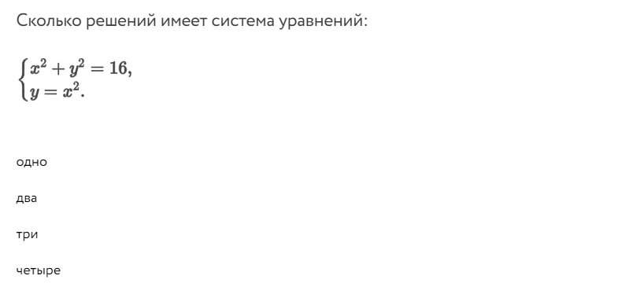

# Foxford Hide Answers Extension
Расширение браузера для скрытия правильнных/неправильных ответов
на платформе [ЭДШ Фоксфорд](https://foxford.ru) 
---

### Установка
Скачайте проект: На странице проекта нажмите на **Code**, затем на **Download ZIP**, после загрузки распакуйте архив. Далее перейдите на cтраницу `chrome://extensions/`, нажмите на *Загрузить распакованное расширение* и выберите скачанный проект

### Использование
Закрепите расширение в браузере, затем перейдите к любому заданию с ответом и нажмите на значок расширения, ответы должны исчезнуть. Чтобы вернуть ответы обратно перезагрузите страницу

---
## Скриншоты:
</img>

----

----

----

----

## Автор
Максим Сергин ([carkin227@gmail.com](mailto:carkin227@gmail.com))

<a href="https://t.me/mitrandirtuta"></img></a>